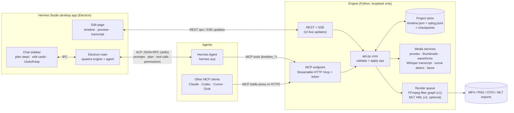

# Hermes Studio Editor: plan

Status: proposal for Pablo, Oct 1, 2026. Research and planning only; no code was changed.
Read with: `REPO-AUDIT.md` (what exists) and `RESEARCH.md` (sources; [n] numbers below refer to it).

---

## 1. One-page brief

**Goal.** Add a real timeline video editor to Hermes Studio that a person can use by hand, and that Hermes Agent (or any AI model) can drive from start to finish, while the person watches and chats in a sidebar.

**Users.**
- Creators who already use Hermes Studio for shorts and want to finish edits without CapCut.
- Hermes Agent users who say "make this into a 60-second explainer with captions" and want to watch it happen.
- Developers and other agents (Claude, Codex, Cursor, Grok) using the same MCP tools.

**Principles.**
1. **Human in command.** The person can stop, undo or override anything at any time. A human edit always wins over a pending agent edit.
2. **Every agent edit is visible and undoable.** Each agent edit is a named entry in the history, with a plain-words summary, before/after thumbnails, and Undo.
3. **One source of truth.** The engine owns the project. UI, CLI, MCP and agents all send the same edit ops to it.
4. **Local and private.** Runs on the user's machine. Nothing is uploaded. The agent has no publish or post tool, ever.
5. **Open and portable.** MIT code, an OTIO-compatible project format, exports other editors can open.
6. **Plain words.** Same house style as today.

**What success looks like (MVP).** A user drops in a 20-minute talk and says *"cut a 60-second highlight, remove filler, add captions, 9:16"*. In the sidebar they watch Hermes plan 5 steps and apply each one; the timeline updates live. They undo one step, nudge a trim by hand, and render an MP4. Every step was visible and could be reversed.

---

## 2. Recommended architecture

**In one sentence:** keep the current Python engine and Electron app. Add a **timeline document + op log** to the engine, an **Edit page** with timeline, preview and transcript to the UI, a **live MCP endpoint** on the engine, and a **chat sidebar** that runs Hermes over ACP.

**How the parts work, step by step:**

1. **Project store.** Each project is a folder: `timeline.json` (current state, with a `version` number), `oplog.jsonl` (every applied batch: actor, summary, ops, inverse ops, version before and after), `checkpoints/` (a snapshot at each chat message), plus a `media/` index. Undo means applying the inverse ops. The design is OTIO-shaped, so exporting to `.otio`, FCP XML and Kdenlive is an adapter, not a rewrite [17][18].
2. **One writer.** Only the engine changes the project. Every op batch carries `base_version`. If it's stale (the user edited in the meantime), the engine rejects it with `conflict` and the current state, and the agent re-reads and retries. That is how "human wins" is enforced.
3. **Live UI.** The engine pushes `timeline.changed` events over SSE. The Edit page re-renders and highlights what changed, coloured by actor.
4. **Live MCP.** The engine serves MCP over Streamable HTTP at `127.0.0.1:<port>/mcp` with a per-launch bearer token. The existing `hermes-studio mcp` stdio command stays and becomes a **proxy** to the running engine (or opens the project headless if no app is running). That keeps `mcp install claude|grok|codex|cursor|hermes` working.
5. **Sidebar <-> Hermes over ACP.** Electron main spawns `hermes acp` and opens a session that points at the engine's MCP endpoint. It streams message chunks, plan updates, tool-call cards and permission requests to the sidebar [38][39][42][43]. Because ACP is an open standard, the same sidebar can host other ACP agents. For "any model" without Hermes, a fallback adapter talks to an OpenAI-compatible endpoint (including Hermes's own API server [41]) with the same tool list.
6. **Preview.** v1: proxy files (540p, short GOP) made at import, and a **sequence player** that plays each clip's proxy range in turn with text and caption overlays drawn on a canvas above it. Frame-exact checks come from engine-rendered frames. v2: WebCodecs decode in the renderer for smooth scrubbing (Chromium supports it) [15][16].
7. **Render.** v1 builds one FFmpeg filter graph from the timeline (trim/concat/overlay/xfade/ASS captions), extending `render.py`. Jobs run in the background with progress, the same as clip jobs today. v2 can export MLT XML and render with `melt` for richer transitions and keyframes [2].

**Why this and not a fork:** see the decision in §7. In short, the GPL desktop NLEs (Shotcut, Kdenlive) are C++/Qt and not agent-ready. OpenCut is mid-rewrite and closed to contributions. Remotion's license blocks an open-source editor at company scale [9]. Our repo already has the engine, packaging, MCP and the op-document pattern (`design.apply_ops`).

---

## 3. Agent action / tool API (MCP)

Rules for every tool: JSON in, JSON out (`structuredContent` plus a text copy [32]); errors carry `code` + `hint` (current contract); times in seconds, as floats, on the timeline clock; everything is addressed by stable IDs, not by list index. Write tools take `base_version`, return `new_version`, an `op_id`, a plain-words `summary` and the `changed_ids`.

**Read (safe, can run in parallel)**

| Tool | Does |
|---|---|
| `project_list` / `project_open` / `project_new` | Find, open or create a project (`aspect`, `fps`, `size`) |
| `timeline_get` | Full timeline JSON, or `summary=true` for a compact outline (tracks, clips, in/out, text) |
| `media_list` / `media_probe` | Imported media with duration, fps, audio, transcript status |
| `transcript_get` | Words with `start`/`end`/`speaker`, mapped to timeline time and to source time; optional range |
| `scenes_get` | Shot cuts (PySceneDetect [19]), silence ranges, face/speaker tracks, clip scores (existing rubric) |
| `timeline_frames` | Frames at given times -> **MCP image content** [32] |
| `timeline_contact_sheet` | A grid of N frames across a range, labelled with timecodes (one image, cheap for the model) |
| `history_list` / `history_diff` | Op log with actor and summary; plain-words diff between two versions |

**Write (each call = one undoable entry)**

| Tool | Does |
|---|---|
| `media_import` | Add a file or URL (yt-dlp) and start proxy/transcript/scene jobs |
| `timeline_apply` | **The core tool.** An atomic batch of ops (below) with a `summary` written for the user |
| `transcript_cut` | Text-based edit: remove or keep word ranges, or "remove fillers"; compiles to ripple-delete ops |
| `captions_generate` | Caption track from the transcript with a style preset (reuses `captions.py` styles) |
| `reframe` | Set the aspect ratio and auto-frame faces (reuses `framing.py`) |
| `history_undo` / `history_redo` / `checkpoint_restore` | Reverse the agent's own steps (the user can always do the same in the UI) |

**Ops inside `timeline_apply`** (small set, all validated, all with inverses):
`insert_clip{media_id, track, at, src_in, src_out}` · `move_clip{id, track?, at}` · `trim_clip{id, src_in?, src_out?, ripple?}` · `split_clip{id, at}` · `delete_clip{id, ripple?}` · `set_props{id, props}` (volume, speed, crop, position, opacity, look) · `add_text{track, at, dur, text, style}` · `add_transition{between:[id,id], kind, dur}` · `keyframe{id, prop, t, value}` · `add_track{kind}` / `remove_track{id}` · `add_marker{at, label}`.

**Render (background jobs)**

| Tool | Does |
|---|---|
| `render_preview` | Low-res render of a range -> path + poster frame; for the agent to check its work |
| `render_final` | Full render with a preset (`9:16-1080`, `16:9-1080`, ...); returns a job id; poll with `job_status` |
| `export_project` | `.otio`, FCP XML or MLT XML for other editors |

Not in the API on purpose: publish, upload, post, delete files outside the project, and shell access.

---

## 4. MVP scope and phased roadmap

Estimates assume the 5 roles in §5 working in parallel. Treat them as rough sizing, not dates.

**Phase 0: Foundations (about 2 weeks)**
- Timeline schema v1 (OTIO-shaped), op set with inverses, op log, version checks, and property tests ("apply then undo gives back the same document").
- Engine SSE channel; MCP Streamable HTTP endpoint with token; stdio proxy mode.
- Fix housekeeping from the audit: FFmpeg/GPL notice, plugin version drift, decide MCP as the main surface.
- **Exit:** a script can build a 3-clip timeline over MCP, undo it, and render it with FFmpeg.

**Phase 1: MVP editor + sidebar (about 6 weeks)**
- Edit page: media bin, timeline with 1 main video track + 1 overlay/text track + 2 audio tracks, drag/trim/split/ripple/snap, keyboard shortcuts, undo/redo.
- Preview: proxies plus the sequence player, playhead, scrub by thumbnail strip.
- Transcript panel: click a word to seek; select text then delete or keep (Descript-style) [23].
- Captions from the transcript, text overlays, crossfade, 9:16/1:1/16:9 with face reframe.
- Chat sidebar with Hermes over ACP: streaming answer, **plan steps**, an **edit card per tool call** (summary, before/after thumbnails, Undo), **Stop**, modes **Ask / Propose (default) / Auto**, a checkpoint per message.
- Render final MP4; "Open in Clips" hand-off from the existing clipper (a clip run becomes an editable timeline).
- **Exit:** the success scenario in §1 works on Linux and Windows on a mid-range laptop.

**Phase 2: Agent quality (about 4 weeks)**
- Contact sheets and `render_preview` loops so the agent checks its own work; scene/silence/speaker data; style presets as grouped ops ("podcast clean-up", "hook-first short").
- Propose mode on a draft branch with side-by-side compare, then Keep or Discard.
- An eval set: 20 scripted editing tasks scored for correctness, number of steps and undo rate.

**Phase 3: Pro and reach**
- Keyframes UI, more transitions, MLT backend, WebCodecs preview, multicam, audio ducking, generative tools as optional plug-ins (new media only [28]), macOS build, OTIO/FCP XML/Kdenlive import and export.

---

## 5. Team split by role

| Role | Owns | First deliverables |
|---|---|---|
| **UI/UX** | Edit page layout, timeline interactions, sidebar cards, modes, highlight-by-actor, accessibility, house look | Clickable prototype of Edit page + sidebar; edit-card spec; keyboard map |
| **Timeline / engine** | Schema, op set and inverses, op log, versions and conflicts, project store, SSE, proxies/thumbnails/waveforms, transcript mapping | Schema v1 + op engine + property tests; SSE; media services |
| **Agent integration** | MCP tools and contracts, HTTP endpoint and stdio proxy, ACP client in Electron, Hermes config/install, OpenAI-compatible fallback, prompts/skill, eval set | Tool schemas; ACP session wired to the sidebar; updated `SKILL.md` |
| **Render pipeline** | Timeline -> FFmpeg graph, preview renders, job queue and progress, presets, exports (OTIO/FCP/MLT), FFmpeg licensing and packaging | Renderer for the MVP op set; golden-file render tests; NOTICE fix |
| **QA / verify** | Contract tests, render golden tests (frame hashes/SSIM), clean-install tests on Linux/Windows, security review of the new write paths (token, origin, paths), agent eval runs | Test plan; CI jobs; security checklist for `/mcp` |

How they work together: the schema and tool contract (Phase 0) are frozen first, and the tests that guard them are written by Engine + QA. Everyone else builds against them.

---

## 6. Risks and open questions

**Risks**
| Risk | Why it matters | Mitigation |
|---|---|---|
| Preview performance | Seeking many clips in an HTML video element can stutter | Short-GOP proxies, preloading the next clip, WebCodecs in Phase 3 |
| Agent and human editing at once | Lost or confusing edits | Single writer, `base_version` checks, the human wins, agent edits shown live |
| Agent quality and cost | Vision calls are slow and pricey; models misjudge timing | Contact sheets instead of many frames, transcript-first editing, eval set, Propose mode by default |
| Protocol churn | ACP v2 and Hermes are moving fast (Hermes ~250k★, frequent releases) | Thin adapter layer; pin versions; OpenAI-compatible fallback |
| New write path = new attack surface | The desk has no login today | Per-launch token, loopback only, origin checks, op caps, no shell or publish tools |
| Licensing | GPL FFmpeg ships today without a notice | Add the notice and source link now; keep GPL tools as separate programs |
| App size | Already 313-493 MB | Proxies and models downloaded on demand; no second engine |
| Scope creep | "CapCut-class" is huge | Hold the MVP op set; everything else goes into Phase 3 |

**Open questions for later (not blocking)**
1. Is Windows + Linux enough for the MVP, or is macOS needed sooner?
2. Default agent mode: Propose (recommended) or Auto?
3. Should a clip run from the clipper open as a timeline by default?
4. Retire the native Hermes plugin in favour of MCP only, or keep it as a shim?
5. Which models to test against (Hermes with a local model vs. a hosted frontier model)? This affects how much the vision tools are used.

---

## 7. The one decision for Pablo

> **Approve building the editor inside the existing Hermes Studio repo and app, on our own OTIO-shaped JSON timeline with an undoable op log, rendered by FFmpeg, with Hermes connected through an ACP chat sidebar and our MCP tools. That means no fork of Kdenlive/Shotcut/OpenCut and no switch to a Remotion/TypeScript stack.**

Why: it reuses everything that already works (engine, installers, MCP, security, CI). It keeps the project MIT and agent-first. It matches the pattern every agent-driven editor is converging on [21][22]. And it leaves room to add MLT or WebCodecs later without a rewrite.
If approved, Phase 0 starts with the timeline schema and op-log contract. That is the single most important artifact, so it gets reviewed before any UI work.
